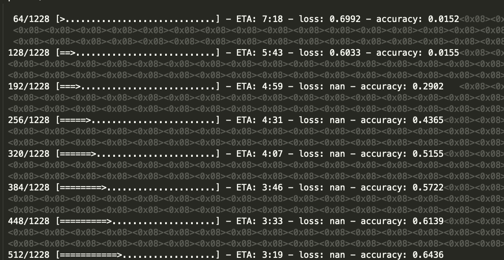

```{r setup, include=FALSE}
knitr::opts_chunk$set(
  echo = TRUE,
  warning = FALSE,
  message = FALSE,
  eval = FALSE,
  fig.align = "center"
)
```

In this article, We will go through explanation about sequence to sequence model. After completing this tutorial, you will know:

* Quick review why Recurrent Neural Network instead of Vanilla Neuaral Network for sequential set data.
* Sequence to sequence model implementation in a various business.
* Many type of text data vectorization in sequence to sequence model.
* The different of Abstractive and Extractive summarization.
* How to build encoder-decoder architecture for text summarization.

I recommend that you have (prerequisites):

* Familiarity with R programming
* Familiarity with neural network and in particular, Recurrent Neural Networks (RNNs). If you are not yet familiear with RNNs, I recommend reading the RNN section which will give you quick start. For you who want to dive deep to RNN architecture please look up to [this article](https://algotech.netlify.com/blog/text-lstm/).
* Willingness to learn, and **sabr** because we know it is not easy to quickly understand new things especially about neural networks.. :)

# Text Summarization

*Text summarization* is a branch in natural language processing (NLP) to generate a shorter and concise version of a text while preserving the meaning of the original text. Text summarization is nowadays has been applied in a lot of business, for example, news websites that use *text summarization* to give the readers an overview of what a particular article talk about.

> **Goal**: reducing a text with a computer program in order to create summary that retain the most important points of the original text.

Automatic text summarization is very challenging, because we as humans summarize a piece of text, we usually read it entirely to develop our understanding, and then write a summary highlighting its main point. Since computers lack human knowledge and language capability, it make text summarization a very difficult and non-trivial task[^2].

Based on a paper by [Gaikwad, D (2016)](https://pdfs.semanticscholar.org/0681/b372590f7cccc049d24bbddcfb31b68cce61.pdf), text summarizers identify and extract key sentence from the source text and concatenat them to form a concise summary. Below is a list of feature for text summarization [^3].

* **Term Frequency**: The frequently occurring word increases score of sentences. The most common measure widely used to calculate the word frequency is *Term Fequence Inverse Document Frequence* (TF IDF).
* **Location**: It depends on the intuition that inportant sentences are located at certain position in text or in paragraph. First and last sentence of paragraph has greater chance to be included in summary.
* **Cue Method**: Effect of positive or negativity of word on the sentence weight to indicate importance or key idea such as cues: *'in summary'*, *'in conclusion'*, *'the paper describes'*.
* **Title/Headline**: Words in the title and heading of document that occur in sentences are positively related to summarization. Words that appear in the title are also indicative of the topic or subject of the document.
* **Sentence length**: Keeps in view the size of summary. Generally, very long and very short sentences are also not suitable for summary.
* **Similarity**: Similarity can be calculated with linguistic knowledge. it indicated similarity between the sentence antitle of the document, and similarity between the sentence and remaining sentence of the docment. 
* **Proper noun**: For document summarization sentences having proper nouns are important. Like name of a person, place or organizaation.
* **Proximity**: The distance berween text units where entities occur is determining factor for establishing relation between entities.

## Text Summarization Method

In general, there are two difference approaches for text summarization:

1. Extractive summarization
2. Abstractive summarization

### Extractive Method

Extracting text summarization algoritmh are capable of *extracting* key sentence from a text without modifying any word. They depend only on extraction of sentences from the original text. 

> Selecting set of sentences from the source text, then arranging them to form a summary.

```{r echo=FALSE, out.width="60%", eval=TRUE, fig.cap="Fig 1. Extractive Summarization Idea"}
knitr::include_graphics(path = "assets/extractive.png")
```

Methods:

1. Lhun 
2. TextRank
3. SumBasic
4. Edmunson
5. LexRank
6. Latent Semantic Analysis

### Abstractive Methods

Abstractive methods need a deeper analysis of the text. These methods have ability to generate a new sentance, which improves the context of a summary, reduce its redundancy and keep a good compression rate.

```{r echo=FALSE, out.width="60%", eval=TRUE, fig.cap="Fig 2. Abstractive Summarization Idea"}
knitr::include_graphics(path = "assets/abstractive.png")
```

Methods:

1. **Sequence to Sequence Model**
2. Sequence to Sequence with attention
3. Pointer Generation Network
4. Fast Abstractive Reinforcement

On this article we more focused on abstractive methods with RNN sequence to sequence model:

# Sequence to Sequence Method

A lot of algorithms for both extractive and abstractive text summarization are based on Recurrent Neural Networks(RNN). Furthermore, using RNNs in an Encoder-Decoder manner leads us to the well known Sequence-To-Sequence (Seq2Seq) architecture [^1]. A sequence to sequence model lies to numerous system which we face on a daily basis. For example, seq2seq model powers application like *Google Translate* (machine translation), voice-enabled device (speech recognation), video captioning, and online chatbots.

# Recurrent Neural Network

We know that neural network uses an algorithm called **Backpropagation** to update the weights of the network. So what Backpropogation does is it first calculates the gradients from the error using the chain rule, then in updates the weights (*Gradient Descent*). 

When doing backpropogation in simple neural network (1 hidden layer) we might not encounter the problem update weights. But....

> When we build an architecture with a large number of hidden layer (Deep Neural Network) the model is likely to encounter update weight problem called *vanishing* / *exploding* gradient descent.

**Vanishing Gradient Descent**: the update value obtained will exponentially decrease when heading to the input layer. Here are the illustrations, which I took from: [Michael Nguyen's article](https://towardsdatascience.com/illustrated-guide-to-recurrent-neural-networks-79e5eb8049c9)

```{r echo=FALSE, eval = TRUE, out.width='35%'}
knitr::include_graphics('assets/vg1.gif')
```

Gradient descent aims to adjust weights that allow the model to '**learn**'. the nature of the gradient that is, the greater the value of the gradient in the current layer, will affect in the next layer getting bigger. and *vice versa*. This is the problem. When doing BP, each node will calculate the gradient value and update its weight according to the gradient effect on the previous layer. so if the previous layer is small, then adjusting the weights in the current layer will be small. it causes the gradient to shrink exponentially when it goes to the input layer. so that when in the input layer it fails to do the learning due to *vanishing gradient problems*. so the model **fails to learn** when a pass forward is made again to make predictions.

**Exploding Gradient Descent**: the update value obtained will exponentially increase when heading to the input layer. The characteristics of the model have an exploding gradient problem, which is when the cost function results are NaN. 

```{r echo=FALSE, eval = TRUE, out.width='80%'}

```

> From the vasishing / exploding gradient problem mentioned above, the development of architecture from the RNN, namely LSTM and GRU, is able to handle the problem. *will be discussed below*. RNN itself has not been able to handle vanishing gradients due to short-term memory problems.


## What is Seq2Seq method?

Introduced for the first time in 2014 by [Google](https://arxiv.org/pdf/1409.3215.pdf), a sequence to sequence model aims to map a fixed-length input with a fixed length output where the length of input and output may differ. For example, translating "*How are you?*" from English to Indonesian has input of 3 words words and output 2 words "*Apa kabar?*". So, we can't use a reguler LSTM network to map each word from the English sentence to the Indonesian sentence. This is why sequence to sequence model is used to address the problem like that.

## Encoder-Decoder Model

In order to understand the model’s underlying logic, we will go over the below illustration:

```{r echo=FALSE, out.width="60%", eval=TRUE, fig.cap="Fig 3. Encoder-decoder sequence to sequence model"}
knitr::include_graphics(path = "assets/encode-decode.jpeg")
```

1. Encoder: The encoder reads the entire input sequence and encodes it into an internal representation, often a fixed-length vector called the context vector.
2. Decoder: The decoder reads the encoded input sequence from the encoder and generates the output sequence.

> ...RNN Encoder-Decoder, consists of two recurrent neural networks (RNN) that act as an encoder and a decoder pair. The encoder maps a variable-length source sequence to a fixed-length vector, and the decoder maps the vector representation back to a variable-length target sequence [^4].


Both the encoder and the decoder submodels are trained jointly, meaning at the same time. The entire encoded input is used as context for generating each step in the output. The output sequence relies heavily on the context defined in the final output of the encoder, making it challenging for the model to deal with long sentences. In the case of long sequences, there is a high probability that the initial context has been lost by the end of the sequence. An extension of the Encoder-Decoder architecture is to provide a more expressive form of the encoded input sequence and allow the decoder to learn where to pay attention to the encoded input when generating each step of the output sequence. This extension of the architecture is called **attention** [^5].

> *Solution to deal with long sentences:* Bahdanau et al., 2014 and Luong et al., 2015 papers introduced and a technique called “Attention” which allows the model to focus on different parts of the input sequence at every stage of the output sequence allowing the context to be preserved from beginning to end [^9].


# Implementing Text Summarization using Keras

```{r}
library(keras)
library(data.table)
library(textclean)
library(magrittr)

batch_size = 64  # Batch size for training.
epochs = 100  # Number of epochs to train for.
embedding_size = 256  # dimensionality of the encoding space.
num_samples = 100  # Number of samples to train on.

data_path = 'data/amazon-fine-food-reviews/Reviews.csv'
review <- fread(data_path, nrows = num_samples) %>% 
  select(Summary, Text) %>% 
  mutate(Text = Text %>% 
           str_remove_all(pattern = "[[:punct:]]") %>%
           str_to_lower() %>% 
           str_squish(),
         Summary = Summary %>% 
           str_to_lower()
           )
```

```{r}
head(review, 5)
```


```{r}
## Vectorize the data.
input_texts  <- review[[2]]
target_texts <- review[[1]]
input_texts  <- lapply( input_texts, function(s) strsplit(s, split=" ")[[1]])
target_texts <- lapply( target_texts, function(s) strsplit(s, split=" ")[[1]])
head(target_texts)
```

```{r}
input_characters  <- sort(unique(unlist(input_texts)))
target_characters <- sort(unique(unlist(target_texts)))
num_encoder_tokens <- length(input_characters)
num_decoder_tokens <- length(target_characters)
max_encoder_seq_length <- max(sapply(input_texts,length))
max_decoder_seq_length <- max(sapply(target_texts,length))
```


```{r}
cat('Number of samples:', length(input_texts),'\n')
cat('Number of unique input tokens:', num_encoder_tokens,'\n')
cat('Number of unique output tokens:', num_decoder_tokens,'\n')
cat('Max sequence length for inputs:', max_encoder_seq_length,'\n')
cat('Max sequence length for outputs:', max_decoder_seq_length,'\n')
```

```{r}
input_token_index  <- 1:length(input_characters)
names(input_token_index) <- input_characters
target_token_index <- 1:length(target_characters)
names(target_token_index) <- target_characters
encoder_input_data <- array(
  0, dim = c(length(input_texts), max_encoder_seq_length, num_encoder_tokens))
decoder_input_data <- array(
  0, dim = c(length(input_texts), max_decoder_seq_length, num_decoder_tokens))
decoder_target_data <- array(
  0, dim = c(length(input_texts), max_decoder_seq_length, num_decoder_tokens))

for(i in 1:length(input_texts)) {
  d1 <- sapply( input_characters, function(x) { as.integer(x == input_texts[[i]]) })
  encoder_input_data[i,1:nrow(d1),] <- d1
  d2 <- sapply( target_characters, function(x) { as.integer(x == target_texts[[i]]) })
  decoder_input_data[i,1:nrow(d2),] <- d2
  d3 <- sapply( target_characters, function(x) { as.integer(x == target_texts[[i]][-1]) })
  decoder_target_data[i,1:nrow(d3),] <- d3
}
dim(d1)
dim(d2)
```

## Create the model

```{r}
## Define an input sequence and process it.
encoder_inputs  <- layer_input(shape=list(NULL,num_encoder_tokens))
encoder         <- layer_lstm(units=latent_dim, return_state=TRUE)
encoder_results <- encoder_inputs %>% encoder
## We discard `encoder_outputs` and only keep the states.
encoder_states  <- encoder_results[2:3]

## Set up the decoder, using `encoder_states` as initial state.
decoder_inputs  <- layer_input(shape=list(NULL, num_decoder_tokens))
## We set up our decoder to return full output sequences,
## and to return internal states as well. We don't use the
## return states in the training model, but we will use them in inference.
decoder_lstm    <- layer_lstm(units=latent_dim, return_sequences=TRUE,
                              return_state=TRUE, stateful=FALSE)
decoder_results <- decoder_lstm(decoder_inputs, initial_state=encoder_states)
decoder_dense   <- layer_dense(units=num_decoder_tokens, activation='softmax')
decoder_outputs <- decoder_dense(decoder_results[[1]])
```

```{r, eval=FALSE}
## Define the model that will turn
## `encoder_input_data` & `decoder_input_data` into `decoder_target_data`
model <- keras_model( inputs = list(encoder_inputs, decoder_inputs),
                      outputs = decoder_outputs )

## Compile model
model %>% compile(optimizer='rmsprop', loss='categorical_crossentropy')

## Run model
model %>% fit( list(encoder_input_data, decoder_input_data), decoder_target_data,
               batch_size=batch_size,
               epochs=10,
               validation_split=0.2)

## Save model
save_model_hdf5(model,'rev.h5')
save_model_weights_hdf5(model,'rev-wt.h5')
```

```{r}
model <- load_model_hdf5('rev.h5')
load_model_weights_hdf5(model,'rev-wt.h5')
```


## Sampling

```{r}
## Here's the drill:
## 1) encode input and retrieve initial decoder state
## 2) run one step of decoder with this initial state
## and a "start of sequence" token as target.
## Output will be the next target token
## 3) Repeat with the current target token and current states

## Define sampling models
encoder_model <-  keras_model(encoder_inputs, encoder_states)
decoder_state_input_h <- layer_input(shape=latent_dim)
decoder_state_input_c <- layer_input(shape=latent_dim)
decoder_states_inputs <- c(decoder_state_input_h, decoder_state_input_c)
decoder_results <- decoder_lstm(decoder_inputs, initial_state=decoder_states_inputs)
decoder_states  <- decoder_results[2:3]
decoder_outputs <- decoder_dense(decoder_results[[1]])
decoder_model   <- keras_model(
  inputs  = c(decoder_inputs, decoder_states_inputs),
  outputs = c(decoder_outputs, decoder_states))

## Reverse-lookup token index to decode sequences back to
## something readable.
reverse_input_char_index  <- as.character(input_characters)
reverse_target_char_index <- as.character(target_characters)

decode_sequence <- function(input_seq) {
  ## Encode the input as state vectors.
  states_value <- predict(encoder_model, input_seq)
  
  ## Generate empty target sequence of length 1.
  target_seq <- array(0, dim=c(1, 1, num_decoder_tokens))
  ## Populate the first character of target sequence with the start character.
  target_seq[1, 1, target_token_index['\t']] <- 1.
  
  ## Sampling loop for a batch of sequences
  ## (to simplify, here we assume a batch of size 1).
  stop_condition = FALSE
  decoded_sentence = ' '
  maxiter = max_decoder_seq_length
  niter = 1
  while (!stop_condition && niter < maxiter) {
    
    ## output_tokens, h, c = decoder_model.predict([target_seq] + states_value)
    decoder_predict <- predict(decoder_model, c(list(target_seq), states_value))
    output_tokens <- decoder_predict[[1]]
    
    ## Sample a token
    sampled_token_index <- which.max(output_tokens[1, 1, ])
    sampled_char <- reverse_target_char_index[sampled_token_index]
    decoded_sentence <-  paste0(decoded_sentence, sampled_char)
    decoded_sentence
    
    ## Exit condition: either hit max length
    ## or find stop character.
    if (sampled_char == '\n' ||
        length(decoded_sentence) > max_decoder_seq_length) {
      stop_condition = TRUE
    }
    
    ## Update the target sequence (of length 1).
    ## target_seq = np.zeros((1, 1, num_decoder_tokens))
    target_seq[1, 1, ] <- 0
    target_seq[1, 1, sampled_token_index] <- 1.
    
    ## Update states
    h <- decoder_predict[[2]]
    c <- decoder_predict[[3]]
    states_value = list(h, c)
    niter <- niter + 1
  }    
  return(decoded_sentence)
}

for (seq_index in 1:5) {
  ## Take one sequence (part of the training test)
  ## for trying out decoding.
  input_seq = encoder_input_data[seq_index,,,drop=FALSE]
  decoded_sentence = decode_sequence(input_seq)
  target_sentence <- gsub("\t|\n"," ",paste(target_texts[[seq_index]],collapse=' '))
  input_sentence  <- paste(input_texts[[seq_index]],collapse=' ')
  cat('-\n')
  cat('Input sentence  : ', input_sentence,'\n')
  cat('Target sentence : ', target_sentence,'\n')
  cat('Decoded sentence: ', decoded_sentence,'\n')
}

```

# Evaluating Summaries

There are two common metrics for evaluation text summarization result, *bilingual Evaluation Understudy Score* (BLEU) and *Recall-Oriented Understudy for Gisting Evaluation* (ROUGH).

1. BLEU **measures precision**: tells us how much the words (and/ or n-grams) in the machine learning generated summaries appeared in the human reference summaries.
2. Rouge **measures recall**: how much the words (and /  or n-grams) in the human references summaries appeared in the machine generated summaries.
 
## BLEU

The intuition of the BLEU score is we are going to look at the machine generation output and compare to the human references. The approach works by counting matching n-grams in the candidate translation to n-grams in the reference text, where 1-gram or unigram would be each token and a bigram comparison would be each word pair.

> The BLEU metric ranges from 0 to 1. Few translations will attain a score of 1 unless they are identical to a reference translation. For this reason, even a human translator will not necessarily score 1. on a test corpus of about 500 sentences (40 general news stories), a human translator scored 0.3468 against four references and scored 0.2571 against two references [^8].

We can use the BLEU score for other language generation problems such as:

* Language generation.
* Image caption generation.
* Machine translation.
* Speech recognition.

## Rouge


# References

[^1] Sutskever, I., Vinyals, O., & Le, Q. V. (2014) [Sequence to Sequence Learning with Neural Networks](https://papers.nips.cc/paper/5346-sequence-to-sequence-learning-with-neural-networks.pdf)

[^2] Allahyari, M., *et al*. (2017) [Text Summarization Techniques: A brief Survey](https://arxiv.org/pdf/1707.02268.pdf)

[^3] Gaikwad, D. K., Mahender, N. (2016) [A review Paper on Text Summarization](https://pdfs.semanticscholar.org/0681/b372590f7cccc049d24bbddcfb31b68cce61.pdf)

[^4] Cho, Kyunghyun., *et al*. (2014) [Learning Phrase Representations using RNN Encoder–Decoder for Statistical Machine Translation](https://arxiv.org/pdf/1406.1078.pdf)

[^5] Brownlee, J. (2017) [Encoder-Decoder Models for Text Summarization in Keras](https://machinelearningmastery.com/encoder-decoder-models-text-summarization-keras/)

[^6] [Understanding Encoder-Decoder Sequence to Sequence Model](https://towardsdatascience.com/understanding-encoder-decoder-sequence-to-sequence-model-679e04af4346)

[^7] [A Gentle Introduction to Calculating the BLEU Score for Text](https://machinelearningmastery.com/calculate-bleu-score-for-text-python/)

[^8] Papineni, K., *et al* (2002) [BLEU: a Method for Automatic Evaluation of Machine Translation](https://www.aclweb.org/anthology/P02-1040.pdf)

[^9] Dugar, Pranay. (2019) [Attention - Seq2Seq Models](https://towardsdatascience.com/day-1-2-attention-seq2seq-models-65df3f49e263)