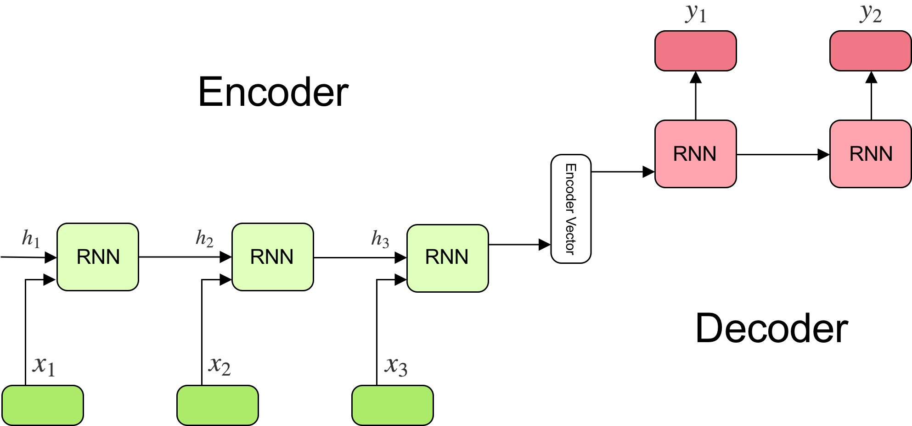

1.  When building an architecture neural network with a large number of hidden layer. We may face a problem, the update value from backpropogation steps will exponentially decrease when heading to the input layer. So the model fails to learn when doing a pass forward to make a predictions. Which of the following statement is appropriate to that problem?
    - [ ] Exploding Gradient Descent
    - [ ] Vanishing Gradient Descent
    - [ ] Backpropogarion Through Time
2.  You are training an RNN, and find that your weights and activation function are all taking on the value of NaN *Not a Number*. Which of these is the most likely cause of this problem?
    - [ ] Vanishing Gradient Descent
    - [ ] Exploding Gradient Descent
    - [ ] Backpropogation Through Time
3.  *Long Short-Term memory* (LSTM) architecture using **gate mechanism** to address a gradient descent's problem. Which gate that aims to controls how many internal states (information) want to exposes to the next time step?
    - [ ] Output gate
    - [ ] Hidden gate
    - [ ] Input gate
4.  We can't use a reguler LSTM network to map a fixed-length input with a fixed length output where the length of input and output may differ. This is why sequence to sequence model is used to address the problem like that. Suppose you build an encoder-decoder model for machine translation.

This model is a "conditional language model" in the sense that the encoder portion (show in green) is modeling the probability of the input sentence of x. Is it the statement is correct?
    - [ ] TRUE
    - [ ] FALSE

5. Compare to the encoder-decoder model shown in question number 4 (which does not use an attention mechanism), we expect the attention model to have the greatest advantage when:
   - [ ] The input sequence length, is large.
   - [ ] The input sequence length, is small.

6. When working with text data, the first thing we must do come up with a strategy to convert string to number or to vectorize the text before feeding it to the model. word embedding is one of the way to do vectorizing text data. Suppose you develop a pre-trained model word embedding which has been trained on huge of corpus of text. Why pre-trained word embedding useful for sequence to sequence model?
   - [ ] effect of language similarity
   - [ ] effect of training data size
   - [ ] effect of learning process
